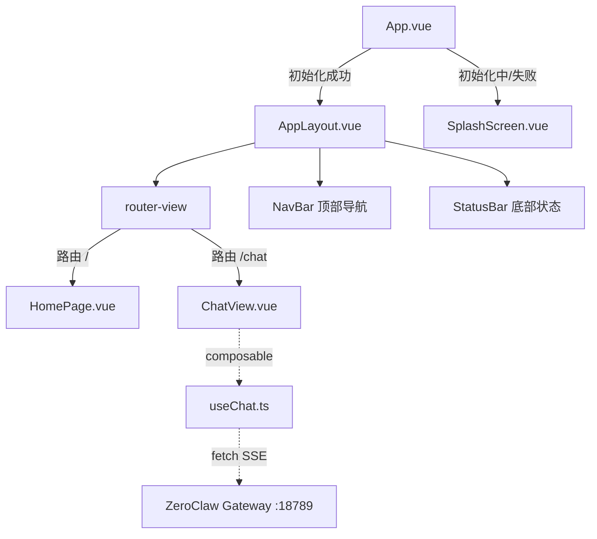

## 用户需求

用户要求实现 EasyClaw 桌面客户端的"对话助手"页面功能。

## 产品概述

在 EasyClaw 客户端中新增对话助手页面，用户可以从主界面点击"对话助手"卡片进入，与 ZeroClaw AI 助手进行自然语言对话。消息以流式方式逐字返回，提供实时交互体验。

## 核心功能

1. **路由导航系统**：引入 Vue Router，支持从主界面功能卡片点击导航到对话助手页面，以及从对话页面返回主界面
2. **对话界面**：包含消息列表区域和底部输入区域，消息区分用户消息和 AI 回复，支持自动滚动到最新消息
3. **消息发送**：用户在输入框输入文本，点击发送按钮或按 Enter 发送消息
4. **流式回复**：通过 HTTP SSE 与 ZeroClaw Gateway (localhost:18789) 通信，AI 回复以流式方式逐字显示
5. **状态反馈**：发送中显示加载指示器，网络错误时显示错误提示并允许重试

## 技术栈

- 前端框架：Vue 3 + TypeScript（Composition API + `<script setup>`）
- 新增依赖：vue-router ^4.4.0（路由管理）
- 构建工具：Vite 5
- 样式：Tailwind CSS 3.4 + 现有设计 Token（dark 色系、glass-card 等）
- 图标：lucide-vue-next
- 测试：Vitest + happy-dom + @vue/test-utils
- 包管理：Yarn
- HTTP 通信：浏览器原生 fetch + ReadableStream（SSE 流式，因需 POST 请求体故不用 EventSource）

## 实现方案

### 整体策略

采用 Vue Router 实现页面级导航，将当前 MainView 拆分为 AppLayout（全局布局壳）+ HomePage（首页内容），新增 ChatView 作为对话助手路由（`/chat`）。对话功能通过 composable（`useChat`）封装，使用 fetch API 以 SSE 流式方式直接与 ZeroClaw Gateway 的 OpenAI 兼容 `/v1/chat/completions` 端点通信。

### 关键技术决策

1. **路由引入**：安装 vue-router，创建 `src/router/index.ts`，使用 `createWebHashHistory`（Tauri 桌面应用推荐 hash 模式）。App.vue 保持 SplashScreen 逻辑不变，初始化成功后渲染 AppLayout。AppLayout 包含 navbar + status-bar + `<router-view>`，主页和对话页成为子路由。

2. **SSE 流式通信**：使用 `fetch` + `ReadableStream` 读取 `text/event-stream` 响应。解析 SSE `data:` 行，提取 `choices[0].delta.content` 增量文本，逐步拼接到消息中。这比 EventSource 更灵活，支持 POST 请求体和自定义 headers。

3. **Gateway 端口**：硬编码 `http://localhost:18789`（与现有 `gateway.rs` 中的服务一致，后续可做配置化）。

4. **composable 设计**：`useChat` 封装消息列表（ref<ChatMessage[]>）、发送逻辑（sendMessage）、流式读取、中断控制（AbortController）、错误处理。纯前端逻辑，不依赖 Tauri 命令。

5. **MainView 拆分策略**：现有 MainView 包含三层（navbar + 内容 + statusbar），拆分后 AppLayout 持有 navbar/statusbar 布局壳，HomePage 只保留欢迎横幅和功能卡片 grid。ChatView 有自己的顶部小标题区（返回箭头 + "对话助手"），但共享 AppLayout 的 statusbar。

### 性能与可靠性

- 使用 AbortController 支持中断正在进行的流式请求
- 消息列表使用 `scrollIntoView({ behavior: 'smooth' })` 实现自动滚动
- SSE 解析使用 TextDecoder 增量处理，避免大文本阻塞
- 离开对话页面时自动 abort 进行中的请求（通过 `onUnmounted` 生命周期）

## 实现注意事项

1. **路由与现有视图切换兼容**：App.vue 的 SplashScreen/AppLayout 切换逻辑保持不变（v-if="state.status === 'success'"），router-view 放在 AppLayout 内部，确保初始化流程不受影响。
2. **现有测试迁移**：MainView.spec.ts 需删除，被 AppLayout.spec.ts + HomePage.spec.ts 替代。测试中需要注入 mock router（vue-router 的 `RouterLinkStub` 或 `createRouter` with `createMemoryHistory`）。
3. **Tauri 安全策略**：前端直接 fetch `http://localhost:18789`。Tauri v2 的 CSP 默认可能限制 connect-src。需检查 `src-tauri/tauri.conf.json` 中的安全配置，可能需要添加 `"dangerousRemoteUrlAccess"` 或在 `security.csp` 中允许 `connect-src http://localhost:18789`。
4. **输入体验**：Enter 发送，Shift+Enter 换行；发送中禁用输入但显示 Stop 按钮。

## 架构设计

### 路由结构

```
App.vue
├── SplashScreen (state !== 'success')
└── AppLayout (state === 'success')  -- 包含 navbar + status-bar + router-view
    ├── / → HomePage (欢迎横幅 + 功能卡片)
    └── /chat → ChatView (对话助手)
```

### 组件架构



### 数据流

用户输入消息 -> useChat.sendMessage() -> fetch POST /v1/chat/completions (stream:true) -> ReadableStream 读取 SSE -> 解析 delta.content -> 追加到 messages 数组 -> Vue 响应式更新 -> 消息列表渲染 -> 自动滚动到底部

## 目录结构

```
src/
├── main.ts                         # [MODIFY] 引入 router，app.use(router)
├── App.vue                         # [MODIFY] MainView 替换为 AppLayout
├── router/
│   └── index.ts                    # [NEW] 路由配置：createRouter + createWebHashHistory，/ -> HomePage，/chat -> ChatView
├── components/
│   ├── SplashScreen.vue            # [不变]
│   ├── MainView.vue                # [删除] 拆分为 AppLayout + HomePage
│   ├── AppLayout.vue               # [NEW] 全局布局壳。从 MainView 提取 navbar（logo+设置按钮）和 statusbar（连接状态+版本号），中间区域放 <router-view>
│   ├── HomePage.vue                # [NEW] 主页内容。从 MainView 提取欢迎横幅和功能卡片 grid，卡片点击通过 router.push 导航到对应路由
│   └── ChatView.vue                # [NEW] 对话助手页面。顶部显示返回按钮+标题，中间消息列表区域（用户气泡靠右/AI气泡靠左），底部输入框+发送按钮。使用 useChat composable
├── composables/
│   ├── useInitialization.ts        # [不变]
│   └── useChat.ts                  # [NEW] 对话逻辑 composable。定义 ChatMessage 类型，封装 messages/isLoading/error 状态，实现 sendMessage（fetch SSE 流式）、abortResponse（AbortController中断）、clearMessages
└── styles/
    └── main.css                    # [MODIFY] 新增 chat-bubble-user、chat-bubble-ai 样式类，typing 光标动画

tests/
├── components/
│   ├── SplashScreen.spec.ts        # [不变]
│   ├── MainView.spec.ts            # [删除] 被下面两个测试替代
│   ├── AppLayout.spec.ts           # [NEW] 测试布局渲染：navbar 存在、statusbar 存在、router-view 占位
│   ├── HomePage.spec.ts            # [NEW] 测试欢迎横幅、4个功能卡片渲染、卡片点击触发路由导航
│   └── ChatView.spec.ts            # [NEW] 测试对话界面渲染、空状态提示、消息显示（用户/AI气泡）、输入框交互
└── composables/
    ├── useInitialization.spec.ts   # [不变]
    └── useChat.spec.ts             # [NEW] 测试消息发送流程、SSE 流式解析、错误处理、中断逻辑、clearMessages

package.json                        # [MODIFY] 新增 vue-router 依赖
README.md                           # [MODIFY] 更新技术栈、项目结构、功能描述
```

## 关键代码结构

### ChatMessage 类型定义

```typescript
// src/composables/useChat.ts
export interface ChatMessage {
  id: string;
  role: 'user' | 'assistant';
  content: string;
  timestamp: number;
  status: 'sending' | 'streaming' | 'done' | 'error';
}
```

### useChat composable 签名

```typescript
export function useChat() {
  const messages: Ref<ChatMessage[]>;
  const isLoading: Ref<boolean>;
  const error: Ref<string | null>;

  function sendMessage(content: string): Promise<void>;
  function abortResponse(): void;
  function clearMessages(): void;

  return { messages, isLoading, error, sendMessage, abortResponse, clearMessages };
}
```

## 设计风格

沿用项目现有的深色毛玻璃风格（Glassmorphism + Dark Theme），保持与 MainView 一致的视觉语言。对话界面采用经典的聊天布局，用户消息靠右、AI 回复靠左，气泡样式与暗色背景形成优雅对比。

### 对话助手页面（ChatView）设计

**Block 1 - 顶部标题区**
沿用 AppLayout 的 glass-nav 导航栏。左侧显示返回箭头图标按钮（ArrowLeft）+ "对话助手"标题文字，右侧显示清空对话按钮（Trash2 图标）。高度 h-12，背景与 glass-nav 一致。点击返回按钮 router.back() 回到首页。

**Block 2 - 消息列表区域**
占据页面主体区域（flex-1），可纵向滚动，内边距 px-4 py-4。空状态时显示居中的引导提示：半透明的 MessageSquare 图标 + "有什么可以帮您？" 文字 + 简短说明文字，使用 text-muted 色。用户消息气泡靠右排列，背景使用 primary 渐变色（bg-gradient-to-r from-primary to-primary-light），白色文字，圆角 rounded-2xl rounded-tr-sm，最大宽度 max-w-[80%]。AI 回复气泡靠左排列，使用 glass-card 样式（bg-white/5 + backdrop-blur + border-white/10），text-primary 色文字，圆角 rounded-2xl rounded-tl-sm。流式输出中的 AI 气泡末尾显示闪烁竖线光标动画（animate-pulse）。每条消息下方显示小字时间戳（text-muted text-[11px]）。

**Block 3 - 底部输入区域**
固定在消息列表下方，glass-nav 背景效果。包含一行输入框 + 发送按钮的横向布局。输入框（textarea）背景 bg-white/5，圆角 rounded-xl，placeholder "输入消息..." 色为 text-muted，文字色 text-primary，自适应高度（最小 1 行，最大 4 行）。发送按钮为 40x40 圆形，背景 primary 渐变（from-primary to-primary-light），内含 Send 图标（白色）；输入内容为空时按钮降低透明度并禁用。正在等待 AI 回复时，发送按钮变为 Square（Stop）图标，点击中断流式响应。整体内边距 px-4 py-3。

**Block 4 - 错误提示条**
当发生网络错误时，在消息列表底部插入一条错误提示。使用 glass-card 样式 + danger/20 边框。显示错误图标 + 错误描述文字 + "重试"按钮。重试按钮使用 text-primary 色文字配 primary/20 背景的 pill 形状。

## SubAgent

- **code-explorer**
- 用途：在实现路由和 CSP 配置阶段，探索 `src-tauri/tauri.conf.json` 中的安全策略配置，确认前端 fetch 请求到 localhost:18789 是否被允许，以及是否需要额外配置
- 预期结果：确认 Tauri v2 安全配置需求，确保前端 SSE 通信不被 CSP 拦截