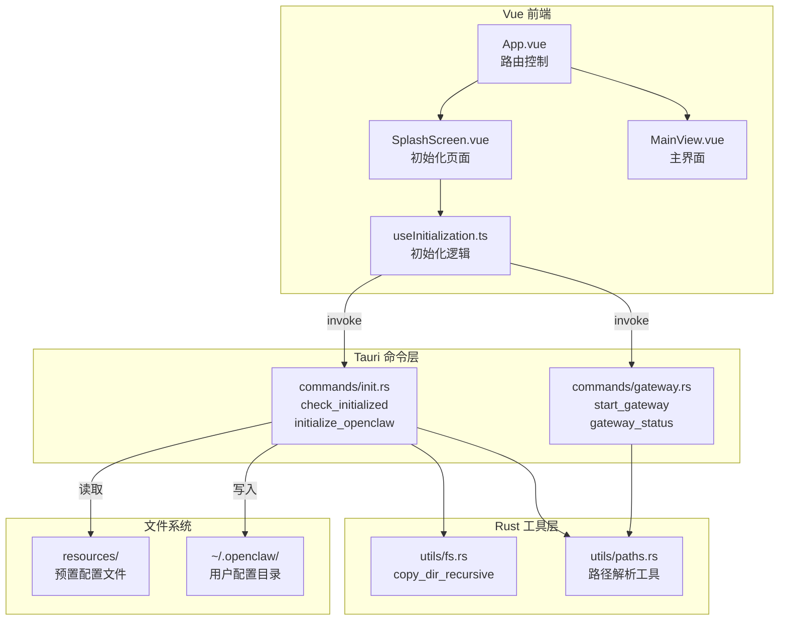

## 产品概述

EasyClaw 是一个基于 Tauri 的 OpenClaw 桌面客户端，核心目标是让普通用户安装后无需任何配置即可使用 OpenClaw 的全部功能。用户双击打开应用，看到品牌加载页和进度条，几秒后直接进入主界面，完全感知不到底层 CLI/Gateway 的存在。

## 核心功能

### 1. 预置默认配置

客户端安装包内置完整的 OpenClaw 默认配置文件，包括主配置文件 openclaw.json、记忆模板文件（MEMORY.md / USER.md / SOUL.md）以及预装技能包（dida / obsidian / summarize）。

### 2. 自动化初始化

客户端首次启动时在后台自动完成初始化：

- 创建用户主目录下的 `~/.openclaw/workspace` 目录结构
- 将预置配置文件复制到对应位置
- 将记忆模板和技能包复制到 workspace 下
- 检测并启动 Gateway 后台服务

### 3. 零干预启动体验

- 启动时展示品牌 Logo 与动画进度条的初始化页面
- 初始化完成后自动过渡到主界面
- 初始化失败时展示友好的错误信息和重试按钮
- 全程无命令行弹窗、无交互式提问

### 4. 主界面

初始化完成后进入主界面，展示欢迎信息与功能入口，底部状态栏显示 Gateway 连接状态。

## 质量约束

- 初始化耗时不超过 5 秒
- 磁盘占用不超过 50MB
- 支持 macOS 12+、Windows 10+、主流 Linux
- 网络离线时仍能完成本地初始化

## 技术栈

| 层级 | 技术选型 |
| --- | --- |
| 桌面框架 | Tauri v2 |
| 前端框架 | Vue 3 + TypeScript |
| 构建工具 | Vite |
| 样式方案 | Tailwind CSS 4 |
| 前端测试 | Vitest + @vue/test-utils |
| 后端语言 | Rust (Tauri v2 内置) |
| 后端测试 | Rust #[cfg(test)] + tempdir |
| 包管理器 | yarn |


## 实现方案

### 整体策略

采用 Tauri v2 的 Command 机制，Rust 后端负责文件系统操作和进程管理，Vue 前端通过 `@tauri-apps/api` 调用后端命令，实现完全解耦的前后端架构。

### 关键技术决策

1. **资源文件打包方式**：使用 Tauri v2 的 `bundle.resources` 配置将 resources/ 目录打包进应用，运行时通过 `tauri::AppHandle::path()` 的 `resource_dir()` 获取实际路径。这比硬编码相对路径更可靠，且跨平台兼容。

2. **初始化状态检测**：通过检查 `~/.openclaw/openclaw.json` 是否存在来判断是否已初始化，简单高效，避免额外的状态文件管理。

3. **Gateway 启动策略**：使用 `std::process::Command` 的 `spawn()` 异步启动 Gateway 进程，不阻塞 UI 线程。Gateway 启动失败不阻止应用进入主界面（降级体验）。

4. **前端状态管理**：使用 Vue 3 的 Composition API（composables）管理初始化状态，不引入额外状态管理库（Pinia 等），保持简单。

5. **进度反馈**：由于初始化步骤是同步的文件拷贝（极快），采用"分步汇报"模式 -- Rust 端将初始化拆分为多个阶段，前端通过 Tauri Events 监听各阶段进度，实现真实的进度条而非假进度。

### 性能考量

- 文件拷贝操作在本地磁盘完成，通常 <1 秒
- Gateway 启动使用 spawn 不阻塞
- 资源文件总量控制在 50MB 以内
- 初始化检测为单次文件存在性检查，O(1) 复杂度

## 实现注意事项

1. **Tauri v2 资源路径**：必须使用 `app.path().resource_dir()` 获取打包后的资源目录，不能使用运行时相对路径。开发模式下需在 tauri.conf.json 的 `bundle.resources` 中正确配置。

2. **跨平台路径处理**：使用 `dirs::home_dir()` 获取用户主目录，Windows 下为 `C:\Users\<username>`，macOS/Linux 下为 `/Users/<username>` 或 `/home/<username>`。所有路径拼接使用 `Path::join()`，不硬编码分隔符。

3. **错误处理策略**：

- 目录创建失败：返回明确错误信息，前端显示重试按钮
- 资源文件缺失：跳过缺失文件，记录警告，不中断整体流程
- Gateway 启动失败：记录错误但允许进入主界面，主界面状态栏提示未连接

4. **幂等性**：初始化操作必须幂等 -- 如果用户删除部分文件后重启，应只补充缺失的部分而非报错。使用"不存在则创建/复制"策略。

5. **Tauri v2 API 变化**：Tauri v2 的前端 API 从 `@tauri-apps/api/tauri` 改为 `@tauri-apps/api/core`，invoke 函数从 core 模块导入。事件监听使用 `@tauri-apps/api/event`。

## 架构设计



## 目录结构

项目从零创建，以下为完整目录规划：

```
EasyClaw/
├── src-tauri/                          # Tauri Rust 后端
│   ├── Cargo.toml                      # [NEW] Rust 依赖配置，包含 tauri v2、dirs、serde、serde_json
│   ├── tauri.conf.json                 # [NEW] Tauri 应用配置，定义窗口、bundle.resources、权限等
│   ├── capabilities/                   # [NEW] Tauri v2 权限能力配置目录
│   │   └── default.json               # [NEW] 默认权限配置，声明 shell:allow-spawn 等能力
│   ├── build.rs                        # [NEW] Tauri 构建脚本
│   ├── icons/                          # [NEW] 应用图标目录
│   ├── resources/                      # [NEW] 预置资源目录，打包进应用
│   │   ├── openclaw.json               # [NEW] OpenClaw 主配置文件，含 model、workspace、gateway 等配置
│   │   ├── MEMORY.md                   # [NEW] 默认长期记忆模板
│   │   ├── USER.md                     # [NEW] 用户信息模板
│   │   ├── SOUL.md                     # [NEW] AI 助手人格模板
│   │   └── skills/                     # [NEW] 预装技能包目录
│   │       ├── dida/                   # [NEW] 滴答清单技能包占位
│   │       │   └── README.md
│   │       ├── obsidian/               # [NEW] Obsidian 技能包占位
│   │       │   └── README.md
│   │       └── summarize/              # [NEW] 摘要技能包占位
│   │           └── README.md
│   └── src/                            # Rust 源码
│       ├── main.rs                     # [NEW] 应用入口，注册 Tauri commands，配置 app builder
│       ├── lib.rs                      # [NEW] 库入口，导出模块
│       ├── commands/                   # [NEW] Tauri Command 模块
│       │   ├── mod.rs                  # [NEW] commands 模块声明
│       │   ├── init.rs                 # [NEW] 初始化命令：check_initialized 检测初始化状态，initialize_openclaw 执行完整初始化流程（创建目录、复制配置、复制模板、复制技能包），支持幂等操作
│       │   └── gateway.rs              # [NEW] Gateway 命令：start_gateway 启动后台服务，gateway_status 检查运行状态
│       └── utils/                      # [NEW] 工具模块
│           ├── mod.rs                  # [NEW] utils 模块声明
│           ├── fs.rs                   # [NEW] 文件系统工具：copy_dir_recursive 递归复制目录，copy_file_if_not_exists 幂等文件复制
│           └── paths.rs                # [NEW] 路径工具：获取 openclaw_dir、workspace_dir、resource_dir 等标准路径
├── src/                                # Vue 前端源码
│   ├── main.ts                         # [NEW] Vue 应用入口，创建 app 实例并挂载
│   ├── App.vue                         # [NEW] 根组件，管理 SplashScreen 与 MainView 的切换逻辑，含过渡动画
│   ├── components/                     # [NEW] 可复用组件
│   │   ├── SplashScreen.vue            # [NEW] 初始化启动页：品牌 Logo、动画进度条、步骤状态文字、错误提示与重试按钮
│   │   └── MainView.vue                # [NEW] 主界面：顶部导航栏、欢迎横幅、功能卡片网格、底部状态栏（显示 Gateway 状态）
│   ├── composables/                    # [NEW] Vue 组合式函数
│   │   └── useInitialization.ts        # [NEW] 初始化逻辑封装：调用 check_initialized 和 initialize_openclaw 命令，管理进度状态、错误状态、重试逻辑
│   ├── styles/                         # [NEW] 样式文件
│   │   └── main.css                    # [NEW] Tailwind CSS 入口 + 全局自定义样式（进度条动画、过渡效果）
│   └── vite-env.d.ts                   # [NEW] Vite 环境类型声明
├── tests/                              # [NEW] 前端测试目录
│   ├── components/
│   │   ├── SplashScreen.spec.ts        # [NEW] SplashScreen 组件测试：渲染状态、进度条展示、错误重试交互
│   │   └── MainView.spec.ts            # [NEW] MainView 组件测试：布局渲染、状态栏展示
│   └── composables/
│       └── useInitialization.spec.ts   # [NEW] useInitialization 组合式函数测试：初始化流程、错误处理、重试逻辑
├── index.html                          # [NEW] HTML 入口文件
├── package.json                        # [NEW] 前端依赖配置
├── tsconfig.json                       # [NEW] TypeScript 配置
├── tsconfig.node.json                  # [NEW] Node 环境 TS 配置
├── vite.config.ts                      # [NEW] Vite 构建配置，含 @tauri-apps/api 外部化
├── vitest.config.ts                    # [NEW] Vitest 测试配置
├── tailwind.config.js                  # [NEW] Tailwind CSS 配置（如 v4 需要则使用 CSS 配置方式）
├── .gitignore                          # [NEW] Git 忽略规则
├── README.md                           # [MODIFY] 补充项目介绍、技术栈、开发指南、构建发布说明
└── OpenClaw客户端初始化提示词.md         # [已有] 提示词文档，不修改
```

## 关键代码结构

### Rust 端核心接口

```rust
// commands/init.rs - 核心初始化命令签名
#[tauri::command]
pub async fn check_initialized() -> Result<bool, String>;

#[tauri::command]
pub async fn initialize_openclaw(app: tauri::AppHandle) -> Result<String, String>;

// commands/gateway.rs - Gateway 管理命令签名
#[tauri::command]
pub async fn start_gateway(app: tauri::AppHandle) -> Result<String, String>;

#[tauri::command]
pub async fn gateway_status() -> Result<bool, String>;
```

### 前端核心接口

```typescript
// composables/useInitialization.ts
interface InitState {
  isInitialized: Ref<boolean>;
  isLoading: Ref<boolean>;
  progress: Ref<number>;       // 0-100
  statusText: Ref<string>;     // 当前步骤描述
  error: Ref<string | null>;
}

function useInitialization(): InitState & {
  initialize: () => Promise<void>;
  retry: () => Promise<void>;
};
```

## 设计风格

采用现代深色玻璃拟态（Glassmorphism）风格，营造科技感和高端氛围。深色背景搭配微妙渐变和毛玻璃效果，传递 AI 助手产品的专业与智能感。

## 页面设计

### 页面一：初始化启动页（SplashScreen）

#### 区块 1：品牌展示区

页面垂直居中，顶部展示 EasyClaw 品牌 Logo（爪形图标 + 文字标识），Logo 带有轻微呼吸光晕动画，背景为深色渐变，底部有微粒子流动效果。

#### 区块 2：进度反馈区

Logo 下方为圆角进度条，宽度 320px，高度 6px，进度条填充色为主色渐变（蓝紫色），带有光泽滑动动画。进度条下方展示当前步骤文字描述（如"正在初始化配置..."），文字使用浅灰色，12px 大小。

#### 区块 3：错误提示区（条件显示）

初始化失败时进度条替换为错误图标和红色提示文字，下方出现"重试"按钮，按钮为圆角矩形，主色渐变背景，hover 时有发光效果。

### 页面二：主界面（MainView）

#### 区块 1：顶部导航栏

高度 56px 的毛玻璃导航栏，左侧为 EasyClaw Logo 小图标和应用名称，右侧为设置齿轮图标按钮。导航栏 backdrop-blur 效果，底部有 1px 的半透明分割线。

#### 区块 2：欢迎横幅

导航栏下方为全宽欢迎卡片，深色渐变背景上叠加抽象几何光效，左侧展示"欢迎使用 EasyClaw"标题和一行简要描述文字，右侧为抽象 AI 图形装饰。卡片圆角 16px，内边距 32px。

#### 区块 3：功能入口网格

2 列卡片网格布局，每张卡片为毛玻璃效果容器（半透明背景 + backdrop-blur），包含顶部图标、功能标题和简短描述。hover 时卡片边框发光并轻微上移。功能卡片包括：对话助手、技能管理、记忆管理、系统设置。

#### 区块 4：底部状态栏

固定底部，高度 32px，左侧显示 Gateway 连接状态指示灯（绿色圆点 = 已连接，红色 = 未连接）和状态文字，右侧显示版本号。背景与导航栏一致的毛玻璃效果。

## 过渡动画

初始化页到主界面采用淡出淡入过渡，持续 600ms，初始化页先 opacity 降至 0，主界面从 opacity 0 渐入并伴随轻微上移（translateY 10px -> 0）。