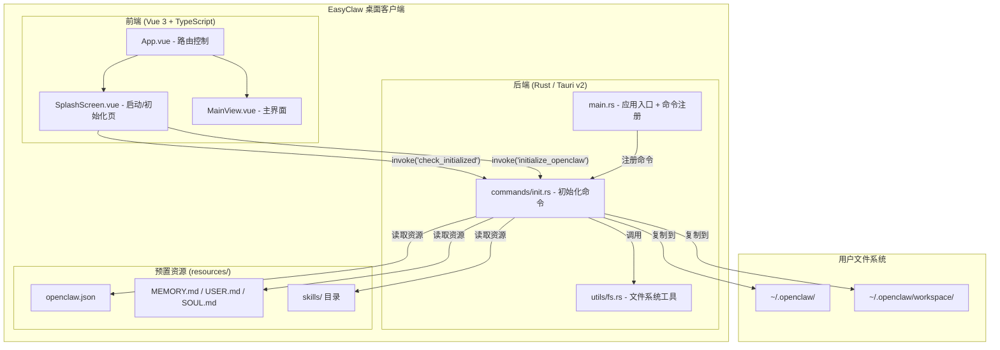

## 产品概述

EasyClaw 是 OpenClaw 的桌面客户端应用，目标是让用户安装后无需任何配置即可使用 OpenClaw 的全部功能。应用采用 Tauri v2 桌面框架，实现"零配置、开箱即用"的体验。

## 核心功能

### 1. 预置默认配置

- 客户端安装包内置 OpenClaw 的默认配置文件（openclaw.json）、记忆文件（MEMORY.md / USER.md / SOUL.md）及预装技能包（dida / obsidian / summarize）
- 用户无需手动创建或编辑任何配置

### 2. 自动化初始化

- 客户端首次启动时自动检测初始化状态
- 未初始化时自动创建 `~/.openclaw/workspace` 目录结构
- 自动复制预置配置文件、记忆文件、技能包到用户目录
- 自动启动 Gateway 后台服务

### 3. 启动界面与进度反馈

- 应用启动后显示品牌加载页面（Splash Screen），展示初始化进度条
- 初始化完成（< 5 秒）后自动过渡到主界面
- 已初始化的场景直接进入主界面

### 4. 主界面

- 提供一个简洁的主界面占位，展示 OpenClaw 已就绪的状态
- 预留后续功能扩展的界面框架

### 5. 错误处理

- 网络离线时仍能完成本地初始化
- 初始化失败时显示友好的错误提示和重试选项
- Gateway 启动失败时不阻塞用户使用本地功能

## 技术栈

- **桌面框架**: Tauri v2（最新稳定版）
- **前端框架**: Vue 3 + TypeScript
- **前端构建**: Vite
- **CSS**: Tailwind CSS
- **后端语言**: Rust
- **包管理器**: yarn
- **Rust 依赖**: dirs（获取用户目录）、serde/serde_json（序列化）、tauri v2 API

## 实现方案

### 整体策略

采用 Tauri v2 + Vue 3 架构，Rust 后端负责文件系统操作和 Gateway 进程管理，Vue 前端负责启动界面和主界面的展示。通过 Tauri v2 的 Resource API（`app.path().resource_dir()`）访问打包在应用内的预置资源文件，确保跨平台兼容。

### 关键技术决策

1. **资源文件打包方式**: 使用 Tauri v2 的 `bundle > resources` 配置将 `resources/` 目录打包到应用安装包中，运行时通过 `app.path().resource_dir()` 获取资源路径，而非硬编码相对路径。这保证了 macOS / Windows / Linux 三端资源路径的一致性。

2. **初始化状态判断**: 检查 `~/.openclaw/openclaw.json` 文件是否存在作为初始化标记，简单可靠，无需额外的状态存储。

3. **Gateway 进程管理**: 使用 Tauri v2 的 `tauri::api::process::Command`（或 `std::process::Command`）来管理 Gateway 进程。Gateway 启动失败不阻塞初始化流程，仅记录警告。

4. **前端状态流转**: App 启动 -> 检查初始化状态 -> (未初始化) Splash 页带进度 -> 初始化完成 -> 主界面；(已初始化) -> 直接主界面。使用 Vue 3 的响应式状态管理控制页面切换。

5. **递归目录复制**: Rust 侧实现 `copy_dir_recursive` 工具函数，用于将 skills 等嵌套目录完整复制到用户目录。

## 实现备注

- **资源路径**: Tauri v2 中必须使用 `AppHandle` 的 `path()` API 获取资源目录，不能使用相对路径。`tauri.conf.json` 中配置 `bundle.resources` 声明需要打包的资源。
- **跨平台兼容**: `dirs::home_dir()` 在三大平台均能正确获取用户主目录；文件路径操作统一使用 `std::path::PathBuf` 保证跨平台兼容。
- **错误处理**: Rust command 使用 `Result<T, String>` 返回，前端 catch 异常后展示友好提示。Gateway 启动作为可选步骤，失败仅返回警告信息不中断初始化。
- **性能**: 文件复制操作量级小（< 50MB），同步 IO 即可在 5 秒内完成。Gateway 使用 `spawn` 异步启动，不阻塞主流程。

## 系统架构



## 目录结构

本项目从零创建，以下是完整的目录结构规划：

```
EasyClaw/
├── README.md                          # [MODIFY] 项目说明文档，补充项目介绍、开发指南、构建说明
├── package.json                       # [NEW] 前端依赖管理，声明 Vue 3、TypeScript、Tailwind CSS、@tauri-apps/api 等依赖
├── vite.config.ts                     # [NEW] Vite 构建配置，配置 Vue 插件和 Tauri 开发服务器集成
├── tsconfig.json                      # [NEW] TypeScript 配置，设置编译选项和路径别名
├── tsconfig.node.json                 # [NEW] Node 环境 TypeScript 配置（用于 vite.config.ts）
├── tailwind.config.js                 # [NEW] Tailwind CSS 配置，定义自定义主题色和字体
├── postcss.config.js                  # [NEW] PostCSS 配置，注册 Tailwind 和 autoprefixer 插件
├── index.html                         # [NEW] 应用入口 HTML，Vite SPA 入口文件
├── src/                               # 前端源码目录
│   ├── main.ts                        # [NEW] Vue 应用入口，创建 Vue 实例并挂载
│   ├── App.vue                        # [NEW] 根组件，负责根据初始化状态切换 SplashScreen 和 MainView
│   ├── style.css                      # [NEW] 全局样式，引入 Tailwind 指令和自定义全局样式
│   ├── views/
│   │   ├── SplashScreen.vue           # [NEW] 启动/初始化页面。展示 EasyClaw 品牌 Logo、初始化进度条、状态文字。调用 Tauri 命令 check_initialized 和 initialize_openclaw，初始化完成后触发跳转
│   │   └── MainView.vue               # [NEW] 主界面。展示应用已就绪状态、欢迎信息、基础功能入口占位，为后续扩展预留框架
│   ├── composables/
│   │   └── useInitialization.ts       # [NEW] 初始化逻辑组合式函数。封装 check_initialized 和 initialize_openclaw 的 Tauri invoke 调用，管理初始化状态（loading/success/error）和进度
│   └── assets/
│       └── logo.svg                   # [NEW] EasyClaw 品牌 Logo SVG 文件
├── src-tauri/                         # Tauri Rust 后端目录
│   ├── Cargo.toml                     # [NEW] Rust 依赖管理，声明 tauri v2、dirs、serde、serde_json 等依赖
│   ├── tauri.conf.json                # [NEW] Tauri v2 配置文件。配置应用名称（EasyClaw）、窗口尺寸、bundle.resources 打包资源目录、应用标识符
│   ├── build.rs                       # [NEW] Tauri 构建脚本
│   ├── capabilities/                  # [NEW] Tauri v2 权限配置目录
│   │   └── default.json              # [NEW] 默认权限配置，授予 core 和 shell 相关权限
│   ├── icons/                         # [NEW] 应用图标目录（Tauri 默认图标）
│   └── src/
│       ├── main.rs                    # [NEW] Rust 主入口。注册 Tauri 命令（check_initialized、initialize_openclaw），配置应用启动逻辑
│       ├── lib.rs                     # [NEW] 库入口，声明模块
│       ├── commands/
│       │   ├── mod.rs                 # [NEW] commands 模块声明
│       │   └── init.rs               # [NEW] 初始化命令实现。包含 check_initialized（检查 ~/.openclaw/openclaw.json 是否存在）和 initialize_openclaw（完整初始化流程：创建目录、复制配置、复制记忆文件、复制技能包、启动 Gateway）
│       └── utils/
│           ├── mod.rs                 # [NEW] utils 模块声明
│           └── fs.rs                  # [NEW] 文件系统工具函数。实现 copy_dir_recursive 递归目录复制功能
├── resources/                         # 预置资源文件目录（打包到安装包中）
│   ├── openclaw.json                  # [NEW] OpenClaw 主配置文件，包含 model、workspace、gatewayPort、channels、memory 等默认配置
│   ├── MEMORY.md                      # [NEW] 默认长期记忆模板文件
│   ├── USER.md                        # [NEW] 用户信息模板文件
│   ├── SOUL.md                        # [NEW] AI 助手人格模板文件
│   └── skills/                        # 预装技能包目录
│       ├── dida/
│       │   └── README.md             # [NEW] 滴答清单技能包说明占位文件
│       ├── obsidian/
│       │   └── README.md             # [NEW] Obsidian 技能包说明占位文件
│       └── summarize/
│           └── README.md             # [NEW] 总结技能包说明占位文件
└── .gitignore                         # [NEW] Git 忽略配置，忽略 node_modules、dist、target 等目录
```

## 关键代码结构

### Rust 初始化命令接口

```rust
// src-tauri/src/commands/init.rs

/// 检查 OpenClaw 是否已完成初始化
/// 返回 true 表示已初始化（~/.openclaw/openclaw.json 存在）
#[tauri::command]
pub async fn check_initialized() -> Result<bool, String>;

/// 执行 OpenClaw 完整初始化流程
/// 接收 AppHandle 以获取打包资源目录路径
/// 返回初始化结果描述信息
#[tauri::command]
pub async fn initialize_openclaw(app: tauri::AppHandle) -> Result<String, String>;
```

### 前端初始化组合式函数接口

```typescript
// src/composables/useInitialization.ts
interface InitState {
  status: 'checking' | 'initializing' | 'success' | 'error';
  progress: number;       // 0-100
  message: string;
  error: string | null;
}

export function useInitialization(): {
  state: Ref<InitState>;
  checkAndInitialize: () => Promise<void>;
  retry: () => Promise<void>;
};
```

## 设计风格

采用现代极简科技风格，以深色主题为基调，融合微妙的玻璃拟态效果，营造高端、专业的桌面应用体验。整体设计聚焦于"简洁、快速、可信赖"的品牌调性。

## 页面规划

### 页面一：启动初始化页（SplashScreen）

应用启动后展示的第一个页面，负责初始化检测和执行。

- **区块 1 - 品牌展示区**: 页面垂直居中，展示 EasyClaw 的 Logo 图标和应用名称，Logo 带有轻微的呼吸光效动画，名称使用渐变色大标题
- **区块 2 - 进度反馈区**: Logo 下方展示一个细长的进度条，带有柔和的渐变色填充和微光流动动画，进度条下方展示当前初始化步骤的描述文字（如"正在准备配置文件..."）
- **区块 3 - 状态提示区**: 进度条下方的小字提示，显示"首次启动，正在为您准备环境"或"正在加载..."等友好提示
- **区块 4 - 错误处理区**: 初始化失败时，隐藏进度条，显示简洁的错误提示卡片和"重试"按钮，卡片使用半透明毛玻璃背景

### 页面二：主界面（MainView）

初始化完成后进入的主工作区界面。

- **区块 1 - 顶部导航栏**: 左侧展示 EasyClaw Logo 和应用名称，右侧展示设置图标按钮和最小化/关闭窗口控制按钮，导航栏使用半透明毛玻璃效果
- **区块 2 - 欢迎横幅区**: 页面顶部的欢迎卡片，展示渐变背景的问候语"欢迎使用 EasyClaw"和简短的功能说明文字，卡片带有柔和的圆角和阴影
- **区块 3 - 功能入口区**: 以卡片网格布局展示核心功能入口（对话、记忆管理、技能包），每张卡片带有图标、标题和简短描述，hover 时有轻微上浮动画和光效变化
- **区块 4 - 状态栏**: 页面底部的细条状态栏，显示 Gateway 连接状态（绿色圆点表示已连接）、当前模型名称，使用半透明背景

## 动效与交互

- 页面切换使用淡入淡出过渡动画（300ms）
- 进度条使用流光渐变动画，增强视觉反馈
- Logo 呼吸光效使用 CSS animation 实现，周期 2s
- 功能卡片 hover 效果：上移 4px + 阴影扩大 + 边框微光
- 错误重试按钮带有 loading 旋转动画